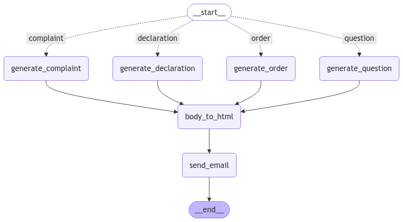

# PhantomMail 📧

[](https://github.com/astral-sh/ruff)
[](https://github.com/astral-sh/uv)


PhantomMail is a  Python application designed to generate and send realistic transport-related emails using advanced AI technology. It leverages Google's Gemini 2.0 Flash model for content generation and Resend for reliable email delivery. The application can automatically generate PDF attachments for documents like customs declarations, making the emails even more realistic and comprehensive.

The application can generate four distinct types of transport-related emails:
- **Transport Orders**: Creates realistic shipping orders with detailed pickup/delivery information
- **Customs Declarations**: Generates comprehensive customs documentation with attachments
- **Customer Inquiries**: Produces natural-sounding questions about shipments
- **Complaint Emails**: Creates authentic-looking customer complaints

The application is built with [LangGraph](https://langchain-ai.github.io/langgraph/), a framework for building and running graphs of computations.




## Features

- Generates realistic transport order data
- Creates convincing email content using Gemini 2.0 Flash
- Converts email content to HTML format
- Sends emails via Resend
- Supports multiple writing styles and languages

## Installation

1. Clone the repository
2. Install dependencies using UV:

```bash
uv sync
```

### Install Pre-Commit Hooks

To ensure code quality, install pre-commit hooks by running the following commands:

1. **Set Up Git Hooks**:
   ```bash
   pre-commit install
   ```
   This will ensure the hooks run automatically before you commit any changes.

2. **Run Hooks on All Files** (Optional):
   ```bash
   pre-commit run --all-files
   ```
   Use this command to apply the hooks across the entire codebase if you're contributing 
   for the first time or after changes to the pre-commit config.

Notes

- Make sure to run these commands after cloning the repository.
- For more details, refer to pre-commit documentation.


## Configuration

Create a `.env.local` file in the root directory with the following variables:

```bash
RESEND_API_KEY= # Get from https://resend.com
GOOGLE_API_KEY= # Your Google API key for Gemini
SENDER_EMAIL= # Email address to send from
LANGCHAIN_TRACING_V2=true
LANGCHAIN_API_KEY= # Optional: For LangChain debugging
LANGCHAIN_PROJECT=phantommail
```

## Usage
Run the application using UV:

```bash
uv run phantommail
```

The application will:
1. Prompt you for a recipient email address
2. Generate a fake transport order
3. Create an email using Gemini AI
4. Convert the content to HTML
5. Send the email via Resend

## Project Structure

- `src/phantommail/main.py`: Entry point and email recipient handling
- `src/phantommail/graphs/`: LangGraph implementation
  - `state.py`: State management for the email generation pipeline
  - `nodes.py`: Graph nodes for data generation, email creation, and sending

## Dependencies

- LangChain
- LangGraph
- Google Generative AI (Gemini Flash 2.0)
- Resend
- Python-dotenv

## Getting Started with Resend

1. Create an account at [https://resend.com](https://resend.com)
2. Get your API key from the dashboard
3. Add the API key to your `.env.local` file

## Deployment Options
### Local
Just the the following command (UV) to launch a local LangGraph server, it will open a LangGraph Studio UI for debugging the flow:

```bash
uvx --refresh --from "langgraph-cli[inmem]" --with-editable . --python 3.13 langgraph dev
``` 
### Self Hosted
Please check out the offical LangGraph documentation located [here](https://langchain-ai.github.io/langgraph/how-tos/deploy-self-hosted/).

### LangGraph Cloud
Clone this repository, then login to LangSmith and deploy the project from there: https://langchain-ai.github.io/langgraph/cloud/quick_start/


## License
MIT